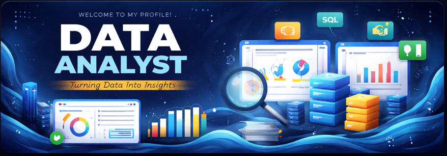

# 🌟 Portfolio Banner

---

#  Hi, I'm Sarthak Raj

---

# 💫 About Me:

- 👨‍💻 **Data Analyst** seeking new opportunities.
- 🤝 I’m looking to collaborate on **Data Analyst projects**
- 🌱 Learning **IT & Data Analytics**
- 💬 Ask me about **anything**. I am happy to help you.

 

---

## 🌐 Connect with me:

 

---

# 💻 Tech Stack:
               

---

## 🎓 Education  

- **Bachelor of Technology (B.Tech)** - *Information Technology*  
  📍 *JIS College of Engineering, Kalyani, West Bengal*  
  📆 *September, 2021 - June, 2025*  

- **Data Analyst Certification** with *E&ICT - IIT Guwahati Certification - Besant Technologies, Bangalore*  
  📊 Focus on Power BI, Excel, SQL, Python, AWS

---

## 🚀 What I Do:
- 📊 Analyze complex datasets to extract **actionable business insights**
- 🗄 Write optimized **SQL queries** for data extraction, cleaning, and transformation
- 📈 Build **interactive dashboards** using **Power BI & Excel** for data-driven decision making
- 🐍 Perform data analysis and automation using **Python (Pandas, NumPy, Matplotlib)**
- 🧹 Clean, preprocess, and validate raw data to ensure **accuracy and consistency**
- 📉 Identify trends, patterns, and KPIs to solve **real-world business problems**
- ☁️ Work with **cloud tools (AWS basics)** for scalable data storage and processing
- 🔍 Apply analytical thinking to convert data into **meaningful stories & insights**

---

# 📊 GitHub Stats:
 
 

  
---

## ✍️ Random Quotes -

  

---

## 💬 “Design. Analyze. Repeat.”  

✨ Thanks for visiting my profile — feel free to check out my repositories and connect with me!
